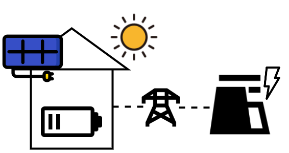

# Building Energy Storage Simulation

[](https://building-energy-storage-simulation.readthedocs.io/en/latest/)



The Building Energy Storage Simulation serves as open source OpenAI gym (now [gymnasium](https://github.com/Farama-Foundation/Gymnasium)) environment for Reinforcement Learning. The environment represents a building with an energy storage (in form of a battery) and a solar energy system. The aim is to control the energy storage so that the self consumption of the energy generated by the solar energy system is optimized.

The inspiration of this project and the data profiles come from the [CityLearn](https://github.com/intelligent-environments-lab/CityLearn) environment. Anyhow, this project focuses on the ease of usage and the simplicity of its implementation. Therefore, this project serves as playground for those who want to get started with reinforcement learning for energy management system control.

## Documentation

The documentation is available at [https://building-energy-storage-simulation.readthedocs.io/](https://building-energy-storage-simulation.readthedocs.io/)

## Installation

By using pip just: 

```
pip install building-energy-storage-simulation
```

or if you want to continue developing the package:

```
git clone https://github.com/tobirohrer/building-energy-storage-simulation.git && cd building-energy-storage-simulation
pip install -e .[docs,tests]
```

## Contribute & Contact

As I just started with this project, I am very happy for any kind of
contribution! In case you want to contribute, or if you have any
questions, contact me via
[discord](https://discord.com/users/tobirohrer#8654).

## Usage

```python
from building_energy_storage_simulation import Environment, BuildingSimulation

simulation = BuildingSimulation()
env = Environment(building_simulation=simulation)

env.reset()
env.step(1)
...
```

**Important note:** This environment is implemented by using [gymnasium](https://github.com/Farama-Foundation/Gymnasium) (the proceeder of OpenAI gym). Meaning, if you are using a reinforcement learning library like [Stable Baselines3](https://github.com/DLR-RM/stable-baselines3) make sure it supports [gymnasium](https://github.com/Farama-Foundation/Gymnasium) environments. 

## Task Description

The simulation contains a building with an energy load profile attached to it. The load is always automatically covered by

- primarily using electricity generated by the solar energy system,
- and secondary by using the remaining required electricity "from the grid"

The simulated building contains a battery which can be used to store energy. By **charging** energy, you can (temporarily)
increase the energy demand of the building, and by **discharging** you can (temporarily) decrease the energy demand of 
the building. **The task is to find strategies of when to charge and when to discharge the battery.** Hereby, 
the goal is to utilize the battery so energy usage from the solar energy system is maximized and usage of the energy 
grid is minimized. Note, that excess energy from the solar energy system which is not used by the electricity load or 
used to charge the battery is considered lost. So better use the solar energy to charge the battery in this case ;-)

 
### Action Space

| Action      | Min      | Max |
| ----------- | ----------- | ----------- |
| Charge | -1      | 1       |

The actions lie in the interval of [-1;1]. The action represents a fraction of the maximum energy which can be retrieved from the battery (or used to charge the battery) per time step.

- 1 means maximum charging the battery. The maximum charge per time step is defined by the parameter `max_battery_charge_per_timestep`.
- -1 means maximum discharging the battery, meaning "gaining" electricity out of the battery
- 0 means don't charge or discharge

### Observation Space

| Index | Observation      | Min | Max |
| ----------- | ----------- | ----------- | ----------- |
| 0 |  State of Charge (in kWh)| 0| Max Battery Capacity |
| [1; n]|  Forecast Electric Load (in kWh) | 0 | Max Load in Profile |
| [n+1; 2*n]|  Forecast Solar Generation (in kWh) |0| Max Solar Generation in Profile |


The length of the observation depends on the length of the forecast used. By default, the simulation uses a forecast length of 4. 
This means 4 time steps of an electric load forecast and 4 time steps of a solar generation forecast are included in the observation. 
In addition to that, the information about the current state of charge of the battery is contained in the observation.

The length of the forecast can be defined by setting the parameter `num_forecasting_steps` of the `Environment()`.


### Reward

As our goal is to use as less energy as possible, the reward is defined by the energy consumed at every time step (times -1): 

$$ r_t = -1 * electricity\_consumed_t $$ 

It is important to note, that the term `electricity_consumed` cannot be negative. This means, excess energy from the solar 
energy system which is not consumed by the electricity load or by charging the battery is considered lost 
(`electricity_consumed` is 0 in this case). 

### Episode Ends

The episode ends if the `max_timesteps` of the `Environment()` are reached.
